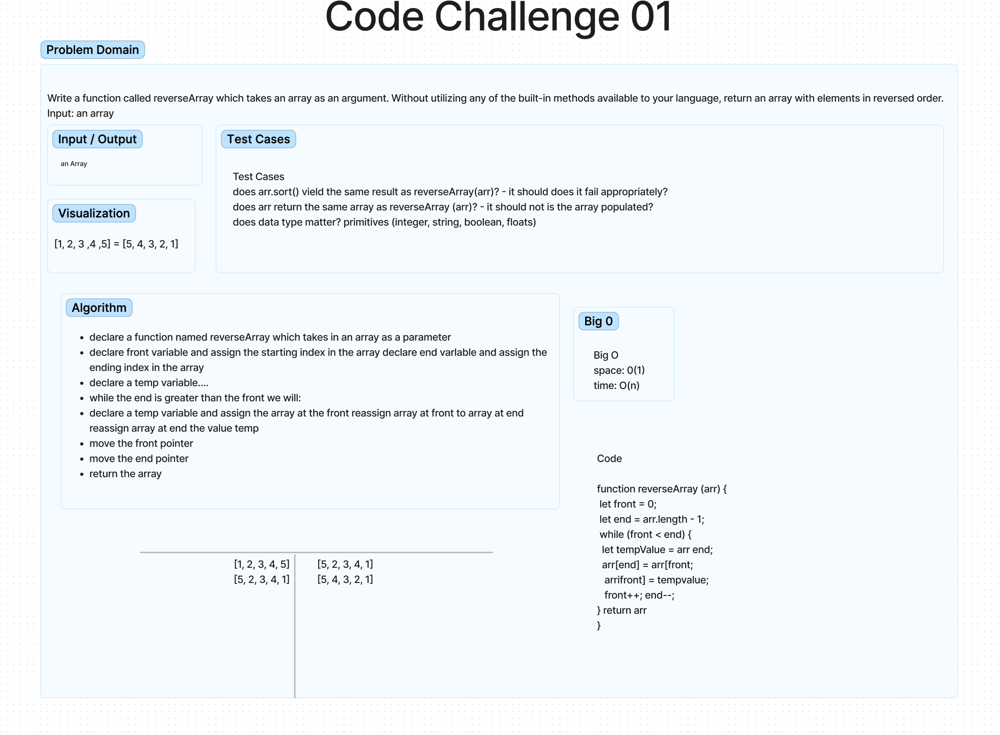

# Code 401 Challenge 01 - Reverse Array

## Objective

Build a  function called reverseArray which takes an array as an argument. Unablle to use any of the built-in methods available to JavaScript, return an array with elements in reversed order.

### Whiteboard Process

Approach & Efficiency

We used inVision to write out the problem domain and visualize the problem.
We used an algorithm to write out the process of what we wanted our code to do.

