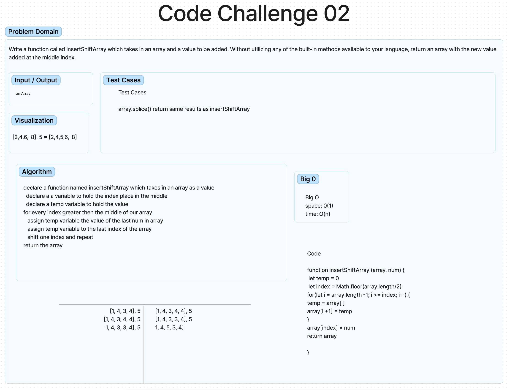

# Code 401 Challenge 2 - Insert to Middle of an Array

## Objective

Write a function called insertShiftArray which takes in an array and a value to be added. Without utilizing any of the built-in methods available to your language, return an array with the new value added at the middle index.
### Whiteboard Process

Approach & Efficiency

I used Figma to write out the problem domain and visualize the problem.
