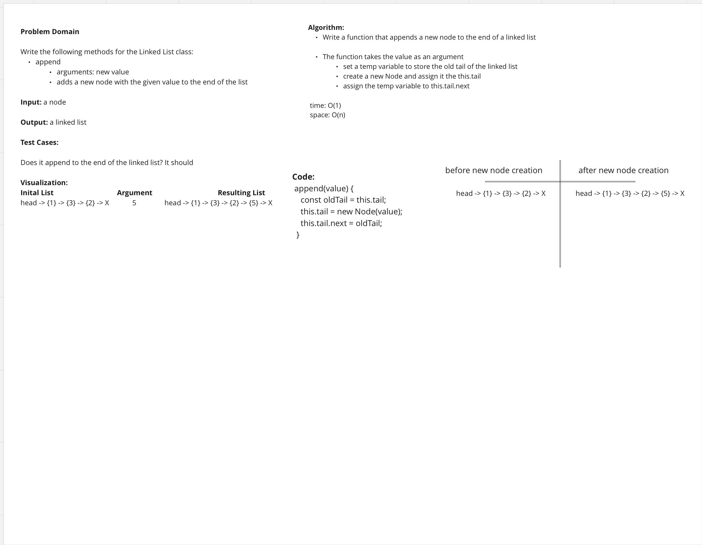

# Singly Linked List
<!-- Short summary or background information -->

A linked list is a linear collection of data elements in computer science, where the linear order of the data elements is not determined by their physical location in memory. Instead, every part relates to the one before it. It is a data structure made up of a collection of nodes that collectively represent a sequence. Each node in the most basic version consists only of data and a reference (or link) to the node after it in the sequence. Using this structure, parts can be added to or taken out of the sequence at any point with minimal effort. Further linkages are included in more complicated variations, enabling effective insertion or removal from arbitrary element references. The linear access time of linked lists is a disadvantage (and difficult to pipeline). It is impossible to implement faster access, like random access. Arrays are more local to the cache than linked lists.

## Challenge
<!-- Description of the challenge -->

### Node

- Create a Node class that has properties for the value stored in the Node, and a pointer to the next Node.

### Linked List

- Create a Linked List class
  - Within your Linked List class, include a head property.
  - Upon instantiation, an empty Linked List should be created.

### Methods

- **append**
  - Arguments: new value
  - Returns: nothing
  - adds a new node with the given value to the end of the list

- **insert before**
  - Arguments: value, new value
  - Returns: nothing
  - Adds a new node with the given new value immediately before the first node that has the value specified

- **insert after**
  - Arguments: value, new value
  - nothing
  - adds a new node with the given new value immediately after the first node that has the value specified

### Structure and Testing

Utilize the Single-responsibility principle: any methods you write should be clean, reusable, abstract component parts to the whole challenge. You will be given feedback and marked down if you attempt to define a large, complex algorithm in one function definition.

You have access to the Node class and all the properties on the Linked List class.

Write tests to prove the following functionality:

- [x] Can successfully add a node to the end of the linked list
- [x] Can successfully add multiple nodes to the end of a linked list
- [x] Can successfully insert a node before a node located i the middle of a linked list
- [x] Can successfully insert a node before the first node of a linked list
- [x] Can successfully insert after a node in the middle of the linked list
- [x] Can successfully insert a node after the last node of the linked list

## Approach & Efficiency
<!-- What approach did you take? Why? What is the Big O space/time for this approach? -->

## API
<!-- Description of each method publicly available to your Linked List -->

- **append**
  - Arguments: new value
  - Returns: nothing
  - adds a new node with the given value to the end of the list

- **insert before**
  - Arguments: value, new value
  - Returns: nothing
  - Adds a new node with the given new value immediately before the first node that has the value specified

- **insert after**
  - Arguments: value, new value
  - nothing
  - adds a new node with the given new value immediately after the first node that has the value specified
