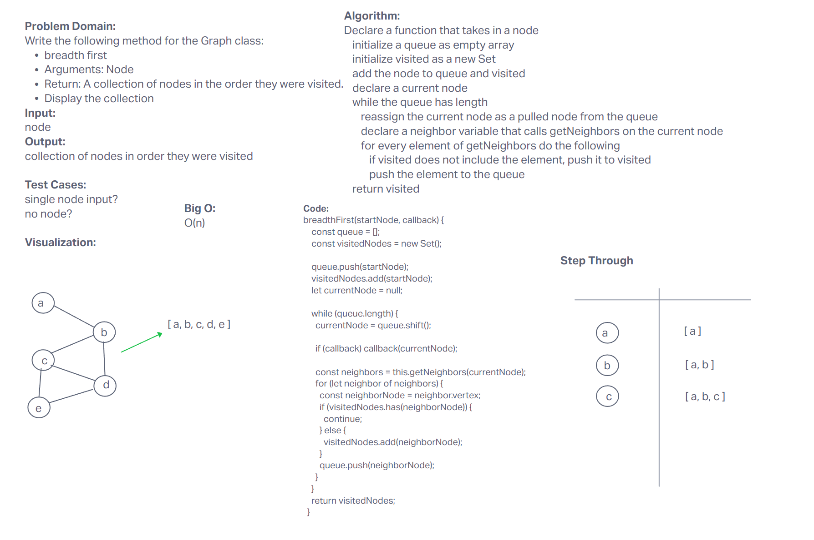
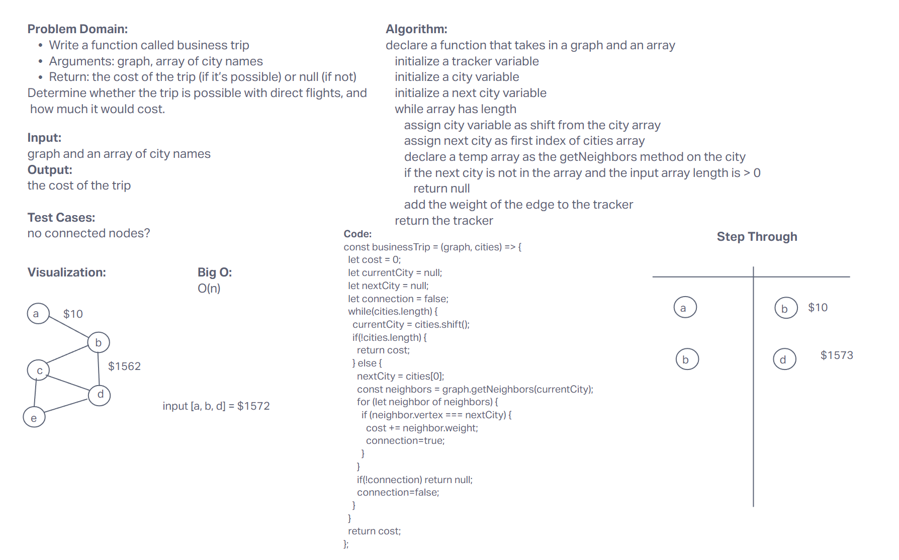

# Code Challenge: Class 30: Graphs

<!-- Short summary or background information -->
Implementation of a Hash Table in JavaScript with the functions

## Whiteboard Process

### Code challenge




## Approach & Efficiency

___

## Main functionalities:

In JavaScript, a graph is a data structure consisting of a set of nodes and the edges connecting those nodes. Nodes are often referred to as vertices, and edges are the lines that connect them.

A directed graph is a graph in which the edges have a specific direction. This means that each edge has a starting node and an ending node, and the direction of the edge is from the starting node to the ending node. In contrast, an undirected graph has edges that do not have a specific direction. This means that the edges can be traversed in either direction.

___

## Key Terms

- Vertex - A vertex, also called a “node”, is a data object that can have zero or more adjacent vertices.
- Edge - An edge is a connection between two nodes.
- Neighbor - The neighbors of a node are its adjacent nodes, i.e., are connected via an edge.
- Degree - The degree of a vertex is the number of edges connected to that vertex.

___

## Methods:

- constructor(size): initializes a new HashTable object with an optional size parameter

### add node


- _set(key, value): adds a new key-value pair to the hash table

  - Arguments: Value
  - Returns: The added node
  - Add a node to the graph

___

### add edge

- Arguments: 2 nodes to be connected by the edge, weight (optional)
- Returns: nothing
- Adds a new edge between two nodes in the graph
- If specified, assign a weight to the edge
- Both nodes should already be in the Graph

### get nodes

- Arguments: none
- Returns all of the nodes in the graph as a collection (set, list, or similar)

___

### get neighbors

- Arguments: node
- Returns a collection of edges connected to the given node
- Include the weight of the connection in the returned collection
- Empty collection returned if there are no nodes

___

### size

- Arguments: none
- Returns the total number of nodes in the graph
  - 0 if there are none

___

## Big 0

Adjacency List

- Add Vetex: 0(1)

- Add Edge: O(1)

- Remove Vertex: O(|V| + |E|)

- Remove Edge: O(|E|)

- Query: O(|V| + |E|)

- Storgage: O(|V| + |E|)

___

## Test

- [X] Node can be successfully added to the graph

``` JS
  it('Tests that the addvertex method adds a new vertex to the graph and that the size of the graph increases by 1', () => {
    const graph = new Graph();
    graph.addVertex(1);
    expect(graph.size()).toBe(1);
    graph.addVertex(2);
    expect(graph.size()).toBe(2);
  });

  ```

___

- [x] Tests that the addvertex method adds a new vertex to the graph and increases the size of the graph

``` JS
  it('Tests that the addvertex method adds a new vertex to the graph and increases the size of the graph', () => {
    const graph = new Graph();
    graph.addVertex(1);
    expect(graph.size()).toBe(1);
    graph.addVertex(2);
    expect(graph.size()).toBe(2);
  });

```

___

- [x] Tests that the breadthfirst method traverses the graph using the breadth-first approach and invokes the callback function with each visited vertex

``` JS
it('Tests that the breadthfirst method traverses the graph using the breadth-first approach and invokes the callback function with each visited vertex', () => {
    const graph = new Graph();
    const vertex1 = graph.addVertex(1);
    const vertex2 = graph.addVertex(2);
    const vertex3 = graph.addVertex(3);
    const vertex4 = graph.addVertex(4);
    graph.addDirectedEdge(vertex1, vertex2);
    graph.addDirectedEdge(vertex1, vertex3);
    graph.addDirectedEdge(vertex2, vertex4);
    graph.addDirectedEdge(vertex3, vertex4);

    const visitedVertices = [];
    const callback = (vertex) => visitedVertices.push(vertex.value);

    graph.breadthFirst(vertex1, callback);

    expect(visitedVertices).toEqual([1, 2, 3, 4]);
  });

```

___

- [x] All appropriate neighbors can be retrieved from the graph

``` JS
const graph = new Graph();
    const vertexA = graph.addVertex('A');
    const vertexB = graph.addVertex('B');
    const vertexC = graph.addVertex('C');

    graph.addDirectedEdge(vertexA, vertexB);
    graph.addDirectedEdge(vertexA, vertexC);

    const neighbors = graph.getNeighbors(vertexA);

    expect(neighbors.length).toBe(2);
    expect(neighbors[0].vertex).toBe(vertexB);
    expect(neighbors[1].vertex).toBe(vertexC);

```

___

- [x] Tests that the depthfirst method traverses the graph using the depth-first approach and invokes the callback function with each visited vertex

``` JS
it('Tests that the depthfirst method traverses the graph using the depth-first approach and invokes the callback function with each visited vertex', () => {
    const graph = new Graph();
    const vertexA = graph.addVertex('A');
    const vertexB = graph.addVertex('B');
    const vertexC = graph.addVertex('C');
    const vertexD = graph.addVertex('D');
    const vertexE = graph.addVertex('E');
    const vertexF = graph.addVertex('F');
    const vertexG = graph.addVertex('G');

    graph.addDirectedEdge(vertexA, vertexB);
    graph.addDirectedEdge(vertexA, vertexD);
    graph.addDirectedEdge(vertexB, vertexC);
    graph.addDirectedEdge(vertexC, vertexG);
    graph.addDirectedEdge(vertexD, vertexE);
    graph.addDirectedEdge(vertexD, vertexF);
    graph.addDirectedEdge(vertexF, vertexG);

    const visited = [];
    const callback = (vertex) => visited.push(vertex);

    graph.depthFirst(vertexA, callback);

    expect(visited).toEqual(['A', 'D', 'F', 'G', 'E', 'B', 'C']);
  });

```

___

- [x] The proper size is returned, representing the number of nodes in the graph

``` JS
it('test_size', () => {
    const graph = new Graph();
    const vertexA = graph.addVertex('A');
    const vertexB = graph.addVertex('B');
    const vertexC = graph.addVertex('C');

    expect(graph.size()).toBe(3);

    graph.addDirectedEdge(vertexA, vertexB);

    expect(graph.size()).toBe(3);


```

___

- [x] Tests that the size method returns the total number of nodes in the graph

``` JS

  it('Tests that the size method returns the total number of nodes in the graph', () => {
    const graph = new Graph();
    const vertexA = graph.addVertex('A');
    const vertexB = graph.addVertex('B');
    const vertexC = graph.addVertex('C');

    expect(graph.size()).toBe(3);

    graph.addDirectedEdge(vertexA, vertexB);

    expect(graph.size()).toBe(3);
  });
```
