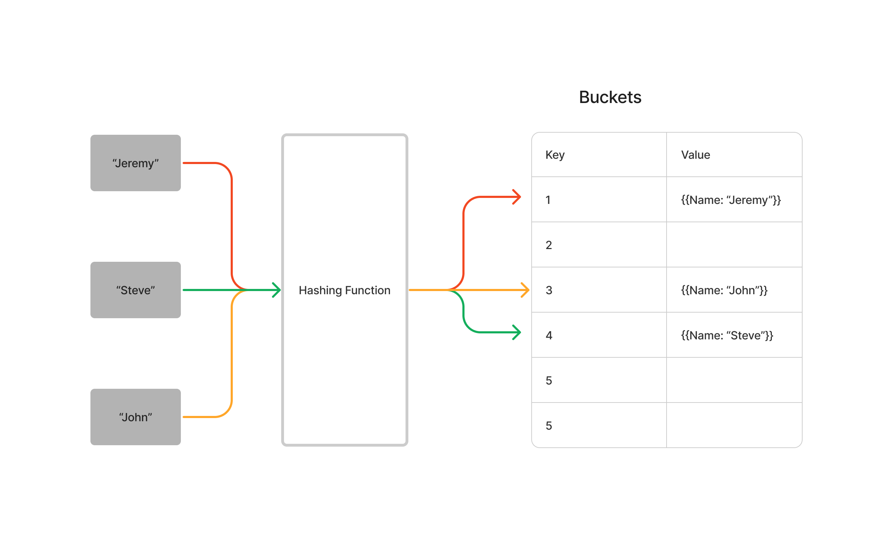

# Code Challenge: Class 30: Hash Table Implementation

<!-- Short summary or background information -->
Implementation of a Hash Table in JavaScript with the functions

- set
- get
- has
- key
- hash

## Whiteboard Process



## Approach & Efficiency

___

## Main functionalities:

The HashTable class is used to implement a hash table data structure, which allows for efficient storage and retrieval of key-value pairs. The class uses a hash function to map keys to indices in an array, where the corresponding values are stored. The main functionalities of the class include adding key-value pairs, retrieving values by key, checking if a key exists in the hash table, and getting an array of all keys in the hash table.

___

## Fields:

- keyMap: an array used to store key-value pairs in the hash table
- size: the size of the keyMap array, which is used in the hash function to calculate indices for keys

___

## Methods:

- constructor(size): initializes a new HashTable object with an optional size parameter

### set

- _set(key, value): adds a new key-value pair to the hash table

  - Arguments: key, value
  - Returns: nothing
  - This method should hash the key, and set the key and value pair in the table, handling collisions as needed.
    - Should a given key already exist, replace its value from the value argument given to this method.

___

### get

- _get(key): retrieves the value associated with a given key from the hash table

  - Arguments: key
  - Returns: Value associated with that key in the table

___

### has

- _has(key): checks if a given key exists in the hash table

  - Arguments: key
  - Returns: Boolean, indicating if the key exists in the table already.

___

### keys

- _keys(): returns an array of all keys in the hash table

  - Returns: Collection of keys

____

### hash

- _hash(key): calculates the hash value for a given key using a hash function

  - Arguments: key
  - Returns: Index in the collection for that key

___

## Big 0

Big O is O(1) unless there is a collision which would be O(N)

___

## Test

- [X] Setting a key/value to your hashtable results in the value being in the data structure

``` JS
it('Tests that the `_set()` method adds a key-value pair to the hash table and updates the value if the key already exists', () => {
    const hashTable = new HashTable();
    hashTable._set('key1', 'value1');
    hashTable._set('key2', 'value2');
    hashTable._set('key1', 'updatedValue');
    expect(hashTable._get('key1')).toEqual(['key1', 'updatedValue']);
  });

  ```

___

- [x] Retrieving based on a key returns the value stored

``` JS

  it('Tests that the `_get()` method retrieves the value associated with a given key and returns undefined if the key does not exist', () => {
    const hashTable = new HashTable();
    hashTable._set('key1', 'value1');
    hashTable._set('key2', 'value2');
    expect(hashTable._get('key1')).toEqual(['key1', 'value1']);
    expect(hashTable._get('nonexistentKey')).toBeUndefined();
  });

```

___

- [x] Successfully return null for a key that does not exist in the hashtable

``` JS

  it('Tests that the `_get()` method retrieves the value associated with a given key and returns undefined if the key does not exist', () => {
    const hashTable = new HashTable();
    hashTable._set('key1', 'value1');
    hashTable._set('key2', 'value2');
    expect(hashTable._get('key1')).toEqual(['key1', 'value1']);
    expect(hashTable._get('nonexistentKey')).toBeUndefined();
  });

```

___

- [x] Successfully returns a list of all unique keys that exist in the hashtable

``` JS

  it('Tests that the `_keys()` method returns an array of unique keys in the hash table, even if they are stored in different sub-arrays of the keymap array', () => {
    const hashTable = new HashTable();
    hashTable._set('key1', 'value1');
    hashTable._set('key2', 'value2');
    hashTable._set('key3', 'value3');
    hashTable._set('key4', 'value4');
    expect(hashTable._keys()).toEqual(['key1', 'key2', 'key3', 'key4']);
  });

```

___

- [x] Successfully handle a collision within the hashtable

``` JS

  it('Tests that the hash table handles collisions correctly', () => {
    const hashTable = new HashTable(2);
    hashTable._set('key1', 'value1');
    hashTable._set('key2', 'value2');
    hashTable._set('key3', 'value3');
    expect(hashTable._get('key1')).toEqual(['key1', 'value1']);
    expect(hashTable._get('key2')).toEqual(['key2', 'value2']);
    expect(hashTable._get('key3')).toEqual(['key3', 'value3']);
  });

```

___

- [x] Successfully retrieve a value from a bucket within the hashtable that has a collision

``` JS

  it('Tests that the hash table handles collisions correctly', () => {
    const hashTable = new HashTable(2);
    hashTable._set('key1', 'value1');
    hashTable._set('key2', 'value2');
    hashTable._set('key3', 'value3');
    expect(hashTable._get('key1')).toEqual(['key1', 'value1']);
    expect(hashTable._get('key2')).toEqual(['key2', 'value2']);
    expect(hashTable._get('key3')).toEqual(['key3', 'value3']);
  });

```

___

- [x] Successfully hash a key to an in-range value

``` JS
  it('Successfully hash a key to an in-range value', () => {
    const hashTable = new HashTable();
    expect(hashTable._hash('key1')).toBeLessThanOrEqual(61);
  });

```

___
