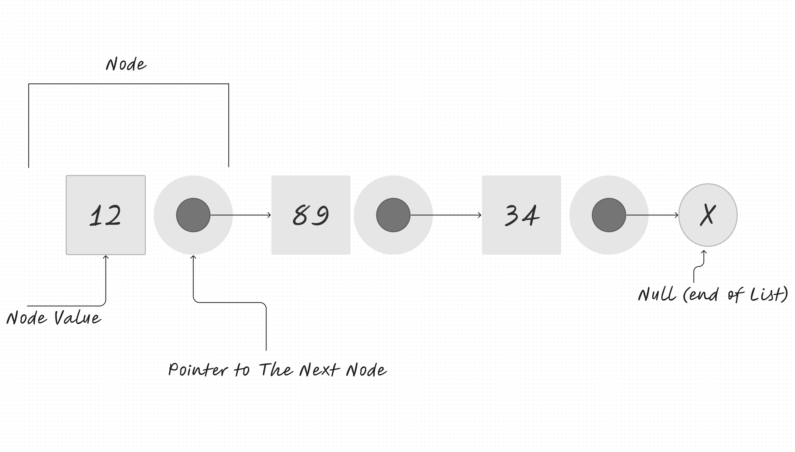

# Singly Linked List
<!-- Short summary or background information -->

A linked list is a linear collection of data elements in computer science, where the linear order of the data elements is not determined by their physical location in memory. Instead, every part relates to the one before it. It is a data structure made up of a collection of nodes that collectively represent a sequence. Each node in the most basic version consists only of data and a reference (or link) to the node after it in the sequence. Using this structure, parts can be added to or taken out of the sequence at any point with minimal effort. Further linkages are included in more complicated variations, enabling effective insertion or removal from arbitrary element references. The linear access time of linked lists is a disadvantage (and difficult to pipeline). It is impossible to implement faster access, like random access. Arrays are more local to the cache than linked lists.

## Challenge
<!-- Description of the challenge -->

### Node

- Create a Node class that has properties for the value stored in the Node, and a pointer to the next Node.

### Linked List

- Create a Linked List class
  - Within your Linked List class, include a head property.
  - Upon instantiation, an empty Linked List should be created.

### Methods

- **insert**
  - Arguments: value
  - Returns: nothing
  - Adds a new node with that value to the head of the list with an O(1) Time performance.

- **includes**
  - Arguments: value
  - Returns: Boolean
  - Indicates whether that value exists as a Node’s value somewhere within the list.

- **to string**
  - Arguments: none
  - Returns: a string representing all the values in the Linked List, formatted as:
  - "{ a } -> { b } -> { c } -> NULL"

### Structure and Testing

Utilize the Single-responsibility principle: any methods you write should be clean, reusable, and abstract component parts to the whole challenge. You will be given feedback and marked down if you attempt to define a large, complex algorithm in one function definition.

Be sure to follow your language/framework's standard naming conventions (e.g. C# uses PascalCasing for all method and class names).

Any exceptions or errors that come from your code should be contextual, descriptive, capturable errors. For example, rather than a default error thrown by your language, your code should raise/throw a custom error that describes what went wrong in calling the methods you wrote for this lab.

Write tests to prove the following functionality:

Can successfully instantiate an empty linked list
Can properly insert into the linked list
The head property will properly point to the first node in the linked list
Can properly insert multiple nodes into the linked list
Will return true when finding a value within the linked list that exists
Will return false when searching for a value in the linked list that does not exist
Can properly return a collection of all the values that exist in the linked list

## Approach & Efficiency
<!-- What approach did you take? Why? What is the Big O space/time for this approach? -->

## API
<!-- Description of each method publicly available to your Linked List -->

- **insert**
  - Arguments: value
  - Returns: nothing
  - Adds a new node with that value to the head of the list with an O(1) Time performance.

- **includes**
  - Arguments: value
  - Returns: Boolean
  - Indicates whether that value exists as a Node’s value somewhere within the list.

- **to string**
  - Arguments: none
  - Returns: a string representing all the values in the Linked List, formatted as:
  - "{ a } -> { b } -> { c } -> NULL"
