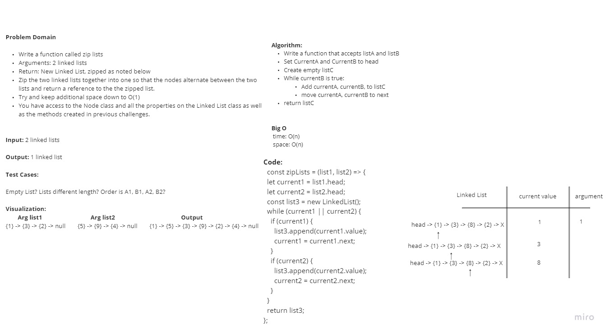

# Singly Linked List | linked-list-zip
<!-- Short summary or background information -->

A linked list is a linear collection of data elements in computer science, where the linear order of the data elements is not determined by their physical location in memory. Instead, every part relates to the one before it. It is a data structure made up of a collection of nodes that collectively represent a sequence. Each node in the most basic version consists only of data and a reference (or link) to the node after it in the sequence. Using this structure, parts can be added to or taken out of the sequence at any point with minimal effort. Further linkages are included in more complicated variations, enabling effective insertion or removal from arbitrary element references. The linear access time of linked lists is a disadvantage (and difficult to pipeline). It is impossible to implement faster access, like random access. Arrays are more local to the cache than linked lists.

## Challenge
<!-- Description of the challenge -->

Write a function called zip list with 2 linked lists as an argument. Return the new linked list. The linked list should be zipped together into one so that the nodes alternate between the two lists.

### Node

- Create a Node class that has properties for the value stored in the Node, and a pointer to the next Node.

### Linked List

- Create a Linked List class
  - Within your Linked List class, include a head property.
  - Upon instantiation, an empty Linked List should be created.

### Methods

- **ziplists**
  - Arguments: two linked lists
  - Returns:  New Linked List, zipped as noted below
  - Zip the two linked lists together into one so that the nodes alternate between the two lists and return a reference to the the zipped list.

### Structure and Testing

Utilize the Single-responsibility principle: any methods you write should be clean, reusable, abstract component parts to the whole challenge. You will be given feedback and marked down if you attempt to define a large, complex algorithm in one function definition.

## Approach & Efficiency
<!-- What approach did you take? Why? What is the Big O space/time for this approach? -->

## API
<!-- Description of each method publicly available to your Linked List -->
