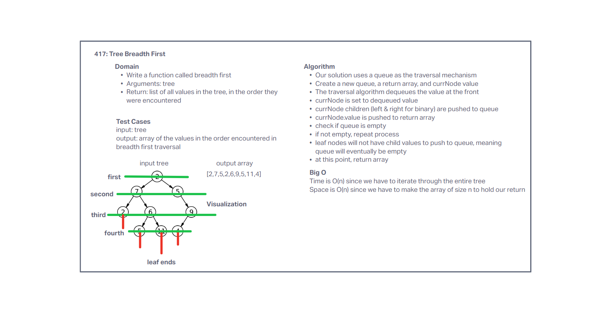

# BinaryTree Breadth First

<!-- Short summary or background information -->
Challenge Setup & Execution

## Features

- ### Binary Search Tree

  - Find maximum value
    - Define a method for each of the depth-first traversals:

    - Arguments: none
    - Returns: number

- #### Methods:

  - Write a function called breadth first
    - Define a method for each of the depth-first traversals:

    - Arguments: none
    - Returns: list of all values in the tree, in the order they were encountered

## Testing

Write tests to prove the following functionality:

[x] Can successfully instantiate an empty tree

[x] Can successfully instantiate a tree with a single root node

[x] Returns a list of all values in the tree, in the order they were encountered

## Queue Visualization

