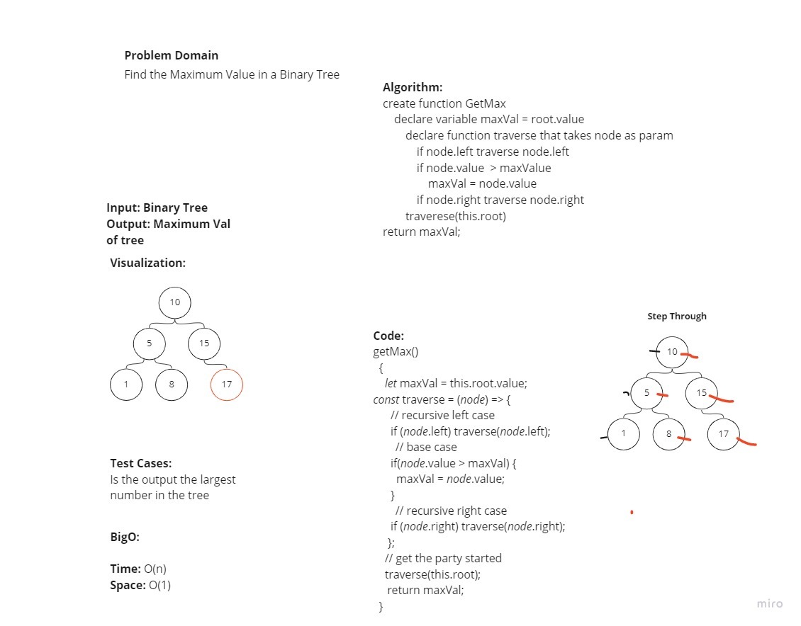

# Binary Tree Max

<!-- Short summary or background information -->
Challenge Setup & Execution

## Features

- ### Node

  - Create a Node class that has properties for the value stored in the node, the left child node, and the right child node.

- ### Binary Tree

  - Find maximum value
    - Define a method for each of the depth-first traversals:

    - Arguments: none
    - Returns: number

- #### Methods:

  - Find maximum value
    - Define a method for each of the depth-first traversals:

    - Arguments: none
    - Returns: number
    - post order

## Testing

Write tests to prove the following functionality:

[x] Can successfully instantiate an empty tree

[x] Can successfully instantiate a tree with a single root node

[x] Returns the value of max node in a given treee

## Queue Visualization

