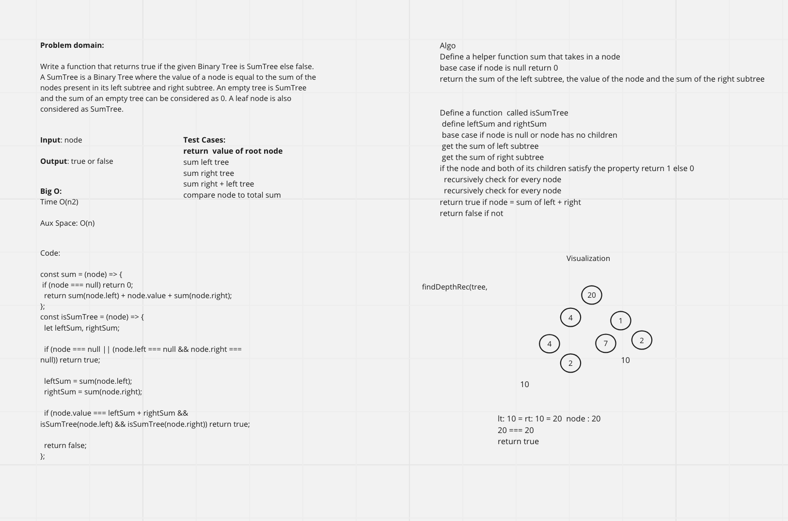

# Binary Tree Max

<!-- Short summary or background information -->
Challenge Setup & Execution

## Features

Problem domain:

Write a function that returns true if the given Binary Tree is SumTree else false. A SumTree is a Binary Tree where the value of a node is equal to the sum of the nodes present in its left subtree and right subtree. An empty tree is SumTree and the sum of an empty tree can be considered as 0. A leaf node is also considered as SumTree.

- ### Binary Tree Method

  - balancedTree()
  - input: root node
  - Returns: true or false

- Expected time complexity: O(N)

## Testing

Write tests to prove the following functionality:

[x] Can sum left side of tree

[x] Can sum right side of tree

[x] Compare total sum to root node and return true or false is they are the same

## Queue Visualization

