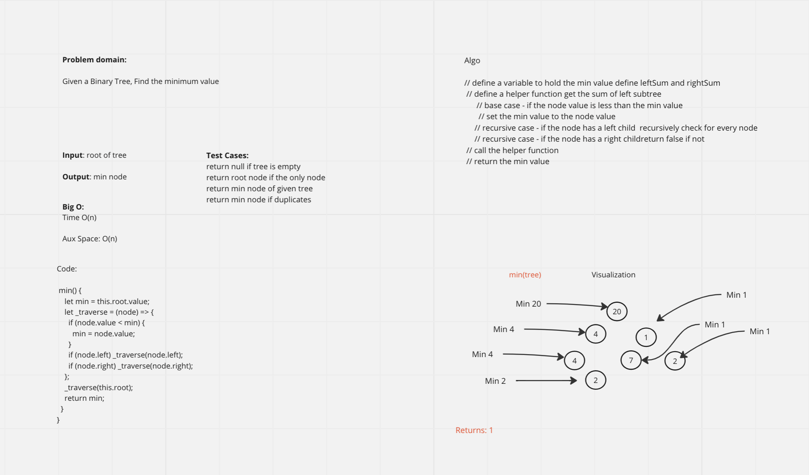

# Binary Tree and BST Implementation

<!-- Short summary or background information -->
Challenge Setup & Execution

## Features

- ### Node

  - Given a Binary Tree, Find the minimum value ...

- ### Binary Tree

  - Create a Binary Tree class
    - Define a method min

- ### Binary Search Tree

  - Create a Binary Search Tree class
    - This class should be a sub-class (or your languages equivalent) of the Binary Tree Class, with the following additional methods:

- #### Methods:

      - min
        - Arguments: tree
        - Return: min

## Testing

Write tests to prove the following functionality:

[x] Can successfully instantiate an empty tree

[x] Can successfully instantiate a tree with a single root node

[x] Returns the value of min node in a given treee

## Queue Visualization

