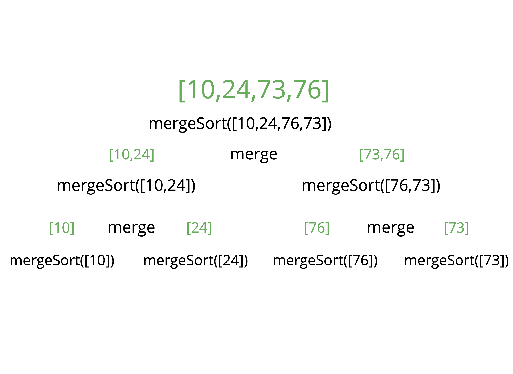

# Blog Notes: Merge Sort

First thing we will need to do is create a helper function to help us with this sorting algorithms

## Merging Arrays Pseudocode

- Create an empty array and then look at the smallest values in each input array.
- While there are still values we haven't looked at.
  - If the value in the first array is less than the value in the second, add the value to the results and move on to the next value in the first array.
  - If the first array's value is larger than the second array's value, append the second array's value to our results and proceed to the next value in the second array.
  - Once we have exhausted one array, we should push in all remaining values from the other array.

```jsx
// Merge function from earlier
function merge(arr1, arr2){
    let results = [];
    let i = 0;
    let j = 0;

    while(i < arr1.length && j < arr2.length){
        if(arr2[j] > arr1[i]){
            results.push(arr1[i]);
            i++;
        } else {
            results.push(arr2[j])
            j++;
        }
    }
    while(i < arr1.length) {
        results.push(arr1[i])
        i++;
    }
    while(j < arr2.length) {
        results.push(arr2[j])
        j++;
    }
    return results;
}
```

## mergeSort Pseudocode

- Break the array in half recursively until you have arrays of length 0 or 1
- Merge the sorted arrays until you have merged all the way up to the full length of the original array
- Return the merged and sorted array

## Implementation

```jsx

function mergeSort(arr){
  // base case
    if(arr.length <= 1) return arr;
  // split array in half
    let mid = Math.floor(arr.length/2);
  // define the left side from index 0 to the midpoint
    let left = mergeSort(arr.slice(0,mid));
  // define the right side from mid to the end
    let right = mergeSort(arr.slice(mid));

    return merge(left, sright);
}

mergeSort([10,24,76,73])
```

## Step Through



## Big O

| Time Complexity (Best) | Time Complexity (Average) | Time Complexity (Worst) | Space Complexity |
| --- | --- | --- | --- |
| Ω(n log(n)) | Θ(n log(n)) | Θ(n log(n)) | O(n) |
